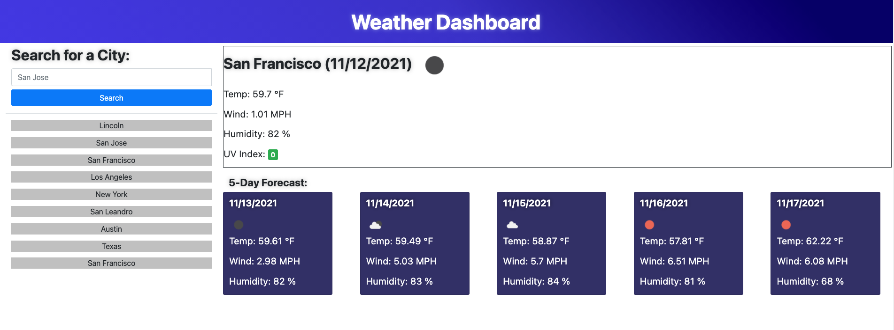
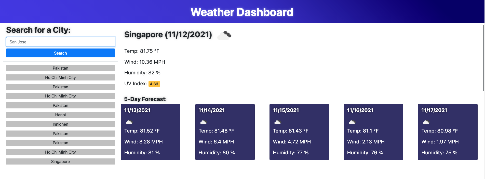
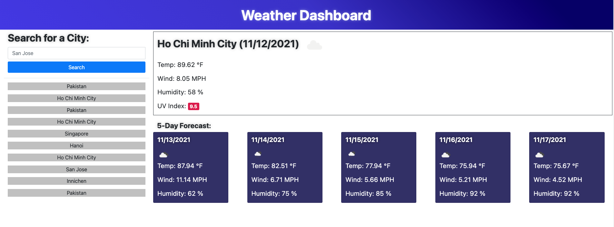

# Weather-Dashboard

## Purpose
* A weather dashboard that will run in the browser and feature dynamically updated HTML and CSS and powered by jQuery. Using the third party APIs (https://openweathermap.org), the deployed application is able to access their data and functionality by making requests with specifics to a URL - therefore, it is able to retrieve weather data for cities.

* Using local storage to store persistent data.

* The application features the current day's and the 5-day forecast weather.

## Built With
* HTML
* CSS
* Javascript
* JQuery
* Bootstrap
* Moment.js
* Third-party API

## Website
https://khanhlam90.github.io/weather-dashboard/

## Contribution

* Self-Built and online-research (such as https://stackoverflow.com/ and https://www.w3schools.com/)

## Screenshots demonstrate the web application's appearance and functionality:

### Notes
* Sample screenshots above demonstrate the landing page and its functions.
* In addition, the different screenshots above showing the differenr color indications for UV Index.
